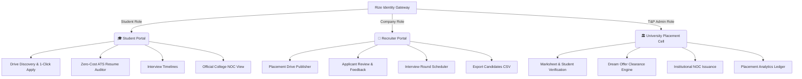

# 🚀 Rize — Next-Gen Campus Placement & Internship Management Ecosystem

<div align="center">


[](https://react.dev/)
[](https://vitejs.dev/)
[](https://tailwindcss.com/)
[](https://nodejs.org/)
[](https://expressjs.com/)
[](https://www.mongodb.com/)
[](LICENSE)

<p align="center">
  <strong>An enterprise-grade, full-stack placement portal uniting Students, Corporate Recruiters, and University Training & Placement (T&P) Officers.</strong>
  <br />
  Featuring zero-cost in-browser ATS resume auditing, one-click candidate pipelines, institutional clearance with official college NOC certificates, and real-time placement analytics.
</p>

[✨ Key Features](#-key-features) • [🏛️ Role Portals](#️-role-portals) • [⚡ Executive ATS Engine](#-executive-ats-resume-engine) • [🚀 Quick Start](#-quick-start-guide) • [🔑 Test Credentials](#-demo--test-credentials) • [📡 API Reference](#-rest-api-reference)

</div>

---

## 📖 Table of Contents

- [🌟 Overview & Mission](#-overview--mission)
- [✨ Key Features](#-key-features)
- [🏛️ Role-Based Portals](#️-role-based-portals)
  - [🎓 1. Student Portal](#1-student-portal-)
  - [🏢 2. Company / Recruiter Portal](#2-company--recruiter-portal-)
  - [🏛️ 3. University T&P Cell (Admin) Portal](#3-university-tp-cell-admin-portal-)
- [⚡ Executive ATS Resume Engine](#-executive-ats-resume-engine)
- [📜 Institutional Clearance & Official College NOC](#-institutional-clearance--official-college-noc)
- [🏗️ System Architecture](#️-system-architecture)
- [🔑 Demo & Test Credentials](#-demo--test-credentials)
- [🚀 Quick Start Guide](#-quick-start-guide)
  - [Prerequisites](#prerequisites)
  - [Backend Setup](#backend-setup)
  - [Frontend Setup](#frontend-setup)
- [📡 REST API Reference](#-rest-api-reference)
- [🎨 Design System & Themes](#-design-system--themes)
- [🛡️ Security & Institutional Placement Policies](#️-security--institutional-placement-policies)
- [🤝 Contributing & License](#-contributing--license)

---

## 🌟 Overview & Mission

University campus placements have historically suffered from chaotic email threads, out-of-sync Excel sheets, delayed interview notifications, and unverified student resumes.

**Rize** reinvents the university placement experience by providing a unified digital operating system for the entire recruitment lifecycle. Built on modern web standards, **Rize** provides instantaneous heuristic resume scoring, granular Role-Based Access Control (RBAC), streamlined interview scheduling, and official institutional No-Objection Certificates (NOC) with verification cryptographic IDs.

---

## ✨ Key Features

- 📑 **In-Browser PDF Viewer Modal**: Preview candidate and student resumes with instant rendering, interactive zoom (70%–160%), fullscreen support, and direct downloads.
- 📜 **Automated Corporate Offer Letter (PDF)**: As soon as a student is selected, an official appointment order is generated in pristine PDF format with full student details, compensation breakdown (Base, Bonus, Health Insurance), joining timeline, and digital HR verification seal — downloadable by both Student and T&P Cell.
- 📊 **One-Click CSV / Excel Exports**: Export candidates rosters, applicants pipelines, and institutional placement ledgers in RFC-compliant CSV formats.
- 🧠 **100% Free Executive ATS Resume Engine**: In-browser heuristic parsing calculating ATS compliance (0-100), tech stack matching, action-verb density, and quantified impact without paid APIs or credit cards.
- 🏛️ **Official University Placement NOC Generator**: Verifiable College Placement No Objection Certificates featuring institutional headers, university seal watermark, digital stamps, and print layouts.
- 🏢 **Dynamic Recruiter Pipeline**: Drive creator, applicant review with feedback reasons, automated status transitions, and Google Meet interview scheduling.
- 🛡️ **1-Student-1-Offer & Dream Offer Governance**: Automatic placement caps with administrative override for top-tier Dream Offer packages.
- 🎨 **Adaptive Multi-Theme Engine**: Switch between Dark, Light, and Solarized/Warm themes with harmonic contrast and accessible typography.

---

## 🏛️ Role-Based Portals



### 1. Student Portal 🎓
- **Personalized Profile & Avatars**: Choose from curated anime aesthetic student avatars, manage CGPA, backlogs, department, semester, and technical skills.
- **Drive Discovery Hub**: Browse live campus placement and internship drives with filterable CTC packages, job roles, eligibility criteria, and deadlines.
- **Application Tracking Pipeline**: Real-time status indicators (`Applied`, `Shortlisted`, `Interview`, `Offered`, `Rejected` with company feedback).
- **In-Browser PDF Resume Preview**: Inspect your uploaded resume with zoom and download capabilities.
- **Official College NOC Certificate**: View and print your approved university No-Objection Certificate once selected.

### 2. Company / Recruiter Portal 🏢
- **Drive Management**: Create and launch placement drives with package ranges (LPA), job descriptions, minimum CGPA requirements, eligible branches, and deadlines.
- **Candidate Evaluation Board**: Review all applicants per drive, inspect contact details, CGPA, backlogs, and preview resumes in 1-click.
- **Granular Rejection Feedback**: Select from predefined feedback reasons (e.g. *Academic Cutoff*, *Skill Mismatch*, *Coding Assessment*) or input custom feedback so students know exactly where to improve.
- **Interview Round Scheduler**: Schedule Technical Rounds and HR interviews with Google Meet / Teams integration, date/time pickers, and candidate instructions.
- **Export Candidate Roster**: Export filtered applicant lists to CSV with a single click.

### 3. University T&P Cell (Admin) Portal 🏛️
- **Academic Verification Gatekeeper**: Audit student grade sheets, verify CGPA legitimacy, and flag students with active backlogs.
- **Institutional Clearance Hub**: Oversee all university applications, audit recruiter rejection reasons, and enforce the **1-Student-1-Offer** policy.
- **Dream Offer Upgrade Clearance**: Grant specific clearances allowing placed students to interview for higher-tier Dream Offers.
- **Official College Placement NOC Issuance**: Issue and revoke official digital No Objection Certificates with unique reference IDs (`NOC/RIZE/2026/XXXXXX`).
- **Institutional Placement Ledger CSV**: Download complete placement analytics including salaries, companies, and offer statuses.

---

## ⚡ Executive ATS Resume Engine

Unlike third-party services that require subscriptions or credit cards, **Rize** includes an **in-browser Executive ATS Auditor** that parses resumes locally with zero latency:

| Pillar | Focus Area | What It Audits |
| :--- | :--- | :--- |
| 🛡️ **ATS Compatibility** | Layout & Formatting | Single-column format, standard font encoding, standard headers (`Experience`, `Education`, `Projects`, `Skills`) |
| ⚡ **Tech Stack Matrix** | Keyword Alignment | Density and presence of modern frameworks, languages, databases, cloud, and tools against job role |
| 🏆 **Content & Metrics** | Quantifiable Impact | Percentage gains, throughput metrics, user counts, latency reductions, and business outcomes |
| 🎯 **Tone & Action Verbs** | Executive Phrasing | Verbs like *Architected*, *Optimized*, *Engineered* instead of passive statements (*worked on*, *helped with*) |
| 📋 **Document Structure** | Readability | Contact accessibility (Email, Phone, GitHub, LinkedIn), length ratio, bullet point structure |

> **Features**:
> - Real-time circular animated score gauge (0–100) with color-coded readiness ratings.
> - Detailed Category Accordion with good/warning tags and actionable tips.
> - Pre-Placement Action Checklist to ensure 100% recruiter readiness before applying.
> - Print-ready report layout for offline review and college portfolio submission.

---

## 📜 Institutional Clearance & Official College NOC

When a student accepts an offer, the University Training & Placement Cell issues an authentic **College Placement No-Objection Certificate (NOC)**:

```
+-------------------------------------------------------------------------+
|                  UNIVERSITY TRAINING & PLACEMENT CELL                   |
|            Institutional Career Development & Placement Board           |
|                                                                         |
|  Ref: NOC/RIZE/2026/F3A912                      Date: September 5, 2026 |
|                                                                         |
|                     NO OBJECTION CERTIFICATE (NOC)                      |
|                                                                         |
|  This is to formally certify that YUG NANDA (Roll: CS2021001), a        |
|  bona fide student of the Department of Computer Science & Engineering, |
|  possessing a CGPA of 9.2 with ZERO backlogs, has been offered campus   |
|  placement at FUNDINGPIPS for Senior Systems Engineer (18-24 LPA).      |
|                                                                         |
|  The Training & Placement Cell confirms NO OBJECTION to the candidate   |
|  undertaking professional employment.                                   |
|                                                                         |
|  [Dean, Academic Affairs]        [VERIFIED STAMP]    [Placement Head]   |
+-------------------------------------------------------------------------+
```

---

## 🏗️ System Architecture

```
d:\Rize\
├── client/                     # React 19 Frontend (Vite)
│   ├── src/
│   │   ├── components/ui/      # OfferLetterModal, PdfPreviewModal, NocCertificateModal, UserAvatar, CompanyLogo
│   │   ├── pages/
│   │   │   ├── student/        # Dashboard, Drives, Applications, ResumeAnalyzer, Profile
│   │   │   ├── company/        # Dashboard, Drives, Applicants, Interviews, Profile
│   │   │   └── admin/          # Dashboard, Students, Drives, Applications, Analytics
│   │   ├── services/           # Axios API connectors (auth, drive, application, student)
│   │   ├── store/              # Zustand Auth Store with persistent session
│   │   └── utils/              # exportCsv.js (RFC-compliant spreadsheet export)
│   └── vite.config.js
│
└── server/                     # Node.js + Express Backend
    ├── config/                 # MongoDB Mongoose database connection
    ├── controllers/            # Auth, Student, Company, Drive, Application, Interview
    ├── middleware/             # JWT auth & Role-Based Access Control (RBAC)
    ├── models/                 # User, Student, Company, Drive, Application, Interview
    ├── routes/                 # Express API routing endpoints
    ├── uploads/                # Local PDF resumes & company logos
    └── server.js               # Application entry point & seed runner
```

---

## 🔑 Demo & Test Credentials

All accounts come pre-seeded with realistic candidate records, placement drives, and applications:

| Role | Email Address | Password | Portal Permissions |
| :--- | :--- | :--- | :--- |
| 🎓 **Student** | `yug@student.rize.in` | `stu@123` | Browse drives, apply, local ATS audit, view NOC |
| 🏢 **Recruiter** | `fundingpips@rize.in` | `comp@123` | Create drives, evaluate applicants, schedule rounds, export CSV |
| 🏛️ **T&P Cell Admin** | `tpcell@rize.in` | `tp@123` | Verify students, approve Dream Offers, issue NOC, export ledger |

---

## 🚀 Quick Start Guide

### Prerequisites
- **Node.js**: `v20.x` or higher (tested on `v22.18.0`)
- **npm**: `v10.x` or higher
- **MongoDB**: `v7.x` or `v8.x` running on `mongodb://localhost:27017`

---

### Backend Setup

1. Open a terminal and navigate to the `server/` directory:
   ```bash
   cd d:\Rize\server
   ```
2. Install server dependencies:
   ```bash
   npm install
   ```
3. Initialize the database and populate seed data:
   ```bash
   node utils/seed.js
   ```
4. Start the Express API server:
   ```bash
   npm run dev
   ```
   *The backend will boot on [http://localhost:5000](http://localhost:5000).*

---

### Frontend Setup

1. Open a second terminal and navigate to the `client/` directory:
   ```bash
   cd d:\Rize\client
   ```
2. Install client dependencies:
   ```bash
   npm install
   ```
3. Start the Vite development server:
   ```bash
   npm run dev
   ```
   *Open [http://localhost:5173](http://localhost:5173) in your browser to start exploring Rize.*

---

## 📡 REST API Reference

### 🔐 Authentication (`/api/auth`)
| Method | Endpoint | Description | Auth Level |
| :--- | :--- | :--- | :--- |
| `POST` | `/api/auth/register` | Register new student or company user | Public |
| `POST` | `/api/auth/login` | Authenticate user and issue JWT token | Public |
| `GET` | `/api/auth/me` | Fetch current session profile & role | Authenticated |

### 🎓 Student Operations (`/api/students`)
| Method | Endpoint | Description | Auth Level |
| :--- | :--- | :--- | :--- |
| `GET` | `/api/students/profile` | Retrieve student profile and academic metrics | Student |
| `PUT` | `/api/students/profile` | Update academic records and skills | Student |
| `POST` | `/api/students/upload-resume` | Upload PDF resume to storage | Student |
| `GET` | `/api/students` | List all enrolled students | T&P Admin |
| `PUT` | `/api/students/:id/verify` | Verify marksheet or flag backlogs | T&P Admin |

### 💼 Placement Drives (`/api/drives`)
| Method | Endpoint | Description | Auth Level |
| :--- | :--- | :--- | :--- |
| `GET` | `/api/drives` | Fetch all approved drives with filters | All Roles |
| `POST` | `/api/drives` | Create a new campus recruitment drive | Company |
| `PUT` | `/api/drives/:id` | Update drive details, package, or deadlines | Company / Admin |
| `PUT` | `/api/drives/:id/status` | Approve or close drive | T&P Admin |

### 📑 Applications & Institutional Clearance (`/api/applications`)
| Method | Endpoint | Description | Auth Level |
| :--- | :--- | :--- | :--- |
| `POST` | `/api/applications/apply` | Apply for an eligible placement drive | Student |
| `GET` | `/api/applications/my` | View student's personal application history | Student |
| `GET` | `/api/applications/company` | View all applicants for company drives | Company |
| `PUT` | `/api/applications/:id/status` | Update candidate status (Offer, Reject, etc.) | Company |
| `PUT` | `/api/applications/:id/noc` | Issue official College NOC & Dream Offer clearance | T&P Admin |

---

## 🎨 Design System & Themes

Rize features a handcrafted CSS token system with full support for 3 distinct color modes:

- 🌑 **Obsidian Dark** (Default): Premium contrast tailored for engineering dashboards and late-night study sessions.
- ☀️ **Clean Light**: Crisp, professional white-surface theme matching corporate enterprise standards.
- 🌾 **Solarized / Warm Cream**: Easy on the eyes with reduced blue light and warm paper hues.

---

## 🛡️ Security & Institutional Placement Policies

1. **Role-Based Access Control (RBAC)**: Secure Express middleware strictly isolates student, recruiter, and T&P admin endpoints.
2. **1-Student-1-Offer Rule**: Once a student receives an offer, the platform enforces compliance to ensure equitable opportunity across the batch.
3. **Dream Offer Policy**: Students holding standard offers are permitted to interview for high-bracket packages only after explicit T&P Cell administrator clearance.
4. **Verifiable NOC Reference Codes**: Every issued certificate includes an immutable, uppercase reference code (`NOC/RIZE/2026/XXXXXX`) for verification with company onboarding teams.

---

## 🤝 Contributing & License

Contributions, issue reports, and feature requests are welcome!

Distributed under the **MIT License**. See `LICENSE` for more information.

<div align="center">
  <sub>Engineered with ❤️ for next-generation university placement ecosystems.</sub>
</div>
